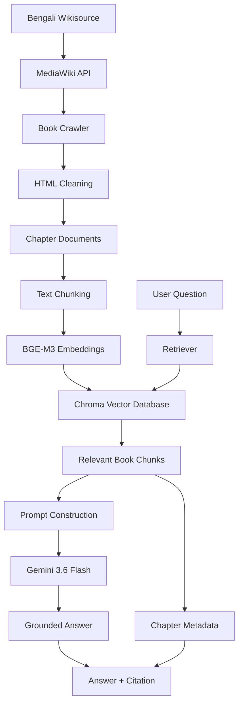

<div align="center">

# 📖 Bangla Book RAG Chatbot

### বাংলা বইভিত্তিক Retrieval-Augmented Generation চ্যাটবট

A Bengali Knowledge-Base Chatbot Powered by Retrieval-Augmented Generation

[](https://www.python.org/)
[](https://www.langchain.com/)
[](https://www.trychroma.com/)
[](https://ai.google.dev/)
[](https://huggingface.co/)
[](https://streamlit.io/)
[](#-license)

**Ask questions about the Bengali novel *দেবদাস* by শরৎচন্দ্র চট্টোপাধ্যায় and receive answers grounded in the book with chapter-level citations.**

</div>

---

## 📑 Table of Contents

* [Overview](#-overview)
* [Key Features](#-key-features)
* [Book Information](#-book-information)
* [System Architecture](#-system-architecture)
* [How the RAG Pipeline Works](#-how-the-rag-pipeline-works)
* [Project Structure](#-project-structure)
* [Technology Stack](#-technology-stack)
* [Setup & Installation](#-setup--installation)
* [Configuration](#-configuration)
* [Running the Project](#-running-the-project)
* [Technical Details](#-technical-details)

  * [Book Ingestion](#book-ingestion)
  * [Chunking Strategy](#chunking-strategy)
  * [Embedding Model](#embedding-model)
  * [Vector Database](#vector-database)
  * [Retriever & LLM](#retriever--llm)
  * [Prompt & Grounding](#prompt--grounding)
  * [Logging & Error Handling](#logging--error-handling)
* [Testing](#-testing)
* [Screenshots](#-screenshots)
* [Demo Video](#-demo-video)
* [Retrieval Comparison Experiment](#-retrieval-comparison-experiment)
* [Future Improvements](#-future-improvements)
* [License](#-license)

---

## 🔎 Overview

**বাংলা বই RAG চ্যাটবট** is a Retrieval-Augmented Generation (RAG) application designed to answer questions about the Bengali novel ***দেবদাস*** by **শরৎচন্দ্র চট্টোপাধ্যায়**.

The system retrieves relevant passages from the book before generating an answer with an LLM. This grounding approach helps keep responses focused on the provided knowledge base rather than relying on the model's general knowledge.

The application follows a strict knowledge-base rule:

> **Answers must be grounded in the book's retrieved content. If the requested information cannot be found in the book, the chatbot should clearly indicate that the information is not available in the knowledge base.**

Each generated response can be traced back to the relevant book chapter or section through citation metadata.

### Core Pipeline

```text
Bengali Wikisource
       │
       ▼
Book Crawling
       │
       ▼
Text Cleaning
       │
       ▼
Chunking + Metadata
       │
       ▼
BGE-M3 Embeddings
       │
       ▼
Chroma Vector Database
       │
       ▼
Similarity Retrieval
       │
       ▼
Gemini 3.6 Flash
       │
       ▼
Answer + Source Citation
```

---

## ✨ Key Features

* 📚 **Book-specific knowledge base** based on the Bengali novel *দেবদাস*
* 🌐 **Automated Wikisource ingestion** using the MediaWiki API
* 🧹 **Content cleaning** to remove navigation and non-story elements
* ✂️ **Semantic-friendly text chunking** with configurable chunk size and overlap
* 🤗 **Local multilingual embeddings** using `BAAI/bge-m3`
* 🗄️ **Persistent Chroma vector database** for efficient similarity search
* 🔎 **Configurable top-k retrieval**
* 🤖 **Gemini 3.6 Flash** for answer generation
* 📖 **Chapter-aware citations** for retrieved sources
* 🛡️ **Grounded-answer behavior** to reduce unsupported responses
* 🔁 **Retry with exponential backoff** for transient API failures
* 📝 **Centralized configuration and logging**
* 💬 **Streamlit chat interface**
* 🧪 **Automated retrieval test suite**
* 📊 **Optional retrieval comparison experiment**

---

## 📚 Book Information

| Field           | Details                                                                                   |
| --------------- | ----------------------------------------------------------------------------------------- |
| **Title**       | দেবদাস (Debdas)                                                                           |
| **Author**      | শরৎচন্দ্র চট্টোপাধ্যায় (Sarat Chandra Chattopadhyay)                                     |
| **Language**    | Bengali                                                                                   |
| **Chapters**    | 16 (পরিচ্ছেদ ১–১৬)                                                                        |
| **Source**      | [Bengali Wikisource](https://bn.wikisource.org/wiki/দেবদাস_%28শরৎচন্দ্র_চট্টোপাধ্যায়%29) |
| **Book Status** | Public domain                                                                             |

The application uses the Bengali Wikisource edition as its knowledge source. The crawler discovers the book's chapter subpages and stores the cleaned chapter content together with source metadata.

---

## 🏗 System Architecture



---

## 🔄 How the RAG Pipeline Works

The chatbot follows a standard Retrieval-Augmented Generation architecture.

### 1. Ingestion

The crawler retrieves the book's chapter pages from Bengali Wikisource through the MediaWiki API.

### 2. Cleaning

The downloaded chapter content is cleaned to remove elements that are not part of the actual story, such as:

* Navigation elements
* Edit links
* Footnote markers
* Navigation tables
* Unnecessary page metadata
* Source/footer clutter

### 3. Chunking

Each chapter is divided into smaller text chunks. Chunk metadata preserves information such as:

* Book name
* Author
* Chapter number
* Chapter name
* Source URL

This metadata is later used to provide meaningful citations.

### 4. Embedding

Each text chunk is converted into a numerical vector using the multilingual **`BAAI/bge-m3`** embedding model.

The embeddings are generated locally through the Hugging Face integration rather than using a separate hosted embedding API.

### 5. Vector Storage

The generated embeddings and associated metadata are stored in a persistent **Chroma** vector database.

### 6. Retrieval

When a user asks a question, the question is converted into an embedding and compared against the stored document vectors.

The most relevant chunks are retrieved according to the configured `TOP_K` value.

### 7. Generation

The retrieved book passages are supplied as context to **Gemini 3.6 Flash**.

The LLM is instructed to answer using the retrieved book content rather than relying on unsupported external knowledge.

### 8. Citation

The retrieved chunks retain their original chapter metadata, allowing the application to identify the relevant chapter or section associated with the answer.

---

## 🗂 Project Structure

```text
bangla-book-rag-chatbot/
│
├── src/
│   ├── config.py              # Central configuration and logging
│   ├── crawler.py             # Wikisource book crawler
│   ├── chunking.py            # Text splitting and metadata creation
│   ├── embeddings.py          # BGE-M3 embedding configuration
│   ├── vectordb.py            # Chroma vector database creation
│   └── rag_pipeline.py        # Retriever + Gemini RAG pipeline
│
├── tests/
│   └── test_retrieval.py      # Retrieval and test-question validation
│
├── data/
│   ├── raw_debdas.json        # Crawled and cleaned book content
│   └── debdas_chunks.json     # Chunked book content
│
├── chroma_db/                 # Persisted Chroma database (git-ignored)
├── logs/                      # Application logs (git-ignored)
├── screenshots/               # Project screenshots
│
├── app.py                     # Streamlit application
├── .env.example               # Environment-variable template
├── .gitignore
├── requirements.txt
├── LICENSE
└── README.md
```

---

## 🧰 Technology Stack

| Component                 | Technology                                |
| ------------------------- | ----------------------------------------- |
| **Language**              | Python 3.10+                              |
| **RAG Framework**         | LangChain                                 |
| **LLM**                   | Gemini 3.6 Flash                          |
| **Embedding Model**       | `BAAI/bge-m3`                             |
| **Embedding Integration** | `langchain-huggingface`                   |
| **Vector Database**       | Chroma                                    |
| **Web/Data Source**       | Bengali Wikisource                        |
| **API**                   | MediaWiki API                             |
| **Web Parsing**           | BeautifulSoup                             |
| **Retry Handling**        | Tenacity                                  |
| **User Interface**        | Streamlit                                 |
| **Testing**               | Pytest                                    |
| **Configuration**         | `.env` + centralized Python configuration |

---

## 🛠 Setup & Installation

### Prerequisites

Make sure the following are installed:

* Python 3.10 or newer
* Git
* A Google Gemini API key
* Sufficient local disk space for the embedding model and vector database

### 1. Clone the Repository

```bash
git clone <your-repository-url>
cd bangla-book-rag-chatbot
```

### 2. Create a Virtual Environment

Linux / macOS / WSL:

```bash
python3 -m venv .venv
source .venv/bin/activate
```

Windows:

```powershell
python -m venv .venv
.venv\Scripts\activate
```

### 3. Upgrade pip

```bash
python -m pip install --upgrade pip
```

### 4. Install Dependencies

```bash
pip install -r requirements.txt
```

The project uses `langchain-huggingface` to integrate the local Hugging Face embedding model with the LangChain pipeline.

### 5. Configure the Gemini API Key

Create a `.env` file from the provided example:

```bash
cp .env.example .env
```

Then add your Gemini API key:

```env
GOOGLE_API_KEY=your_gemini_api_key
```

Do not commit `.env` to Git. API credentials should remain private.

---

## ⚙️ Configuration

Application settings are centralized in `src/config.py` and can be loaded from environment variables.

The main configuration categories include:

```text
API credentials
LLM model
Embedding model
Chunk size
Chunk overlap
Retriever TOP_K
Vector database path
Logging configuration
```

### Example RAG Configuration

```python
llm_model = "gemini-3.6-flash"
embedding_model = "BAAI/bge-m3"
```

The retriever's `TOP_K` value controls how many relevant chunks are returned for each user question.

For example:

```python
TOP_K = int(os.getenv("TOP_K", "6"))
```

Keeping these values configurable makes it easier to experiment with retrieval quality without modifying the core RAG pipeline.

---

## ▶️ Running the Project

The project is designed to be executed in three main stages.

### Step 1 — Crawl the Book

Run the crawler to download and clean the book content:

```bash
python src/crawler.py
```

This generates:

```text
data/raw_debdas.json
```

The file contains the cleaned chapter-level book content and source metadata.

### Step 2 — Build the Vector Database

Generate chunks, embeddings, and the persistent Chroma vector database:

```bash
python src/vectordb.py
```

The resulting vector store is saved under:

```text
chroma_db/
```

The vector database is intentionally excluded from Git because it is a generated artifact.

### Step 3 — Launch the Streamlit Application

Start the chatbot interface:

```bash
streamlit run app.py
```

Streamlit will provide a local URL where the chatbot can be accessed through a web browser.

---

## 🔬 Technical Details

### Book Ingestion

The book is ingested through the **MediaWiki API** provided by Bengali Wikisource.

Instead of relying on fragile HTML URL assumptions, the crawler uses the API to discover the book's chapter pages.

The crawler:

1. Identifies the book's chapter subpages.
2. Retrieves chapter content through the MediaWiki API.
3. Extracts the relevant HTML content.
4. Cleans unwanted page elements.
5. Preserves chapter-level metadata.
6. Saves the processed content as structured JSON.

The chapter discovery process allows the crawler to identify the available chapter pages rather than relying solely on manually hardcoded page URLs.

### Resilience

Network operations are protected with retry logic and exponential backoff.

A polite delay between requests is used to avoid unnecessarily aggressive API traffic.

A descriptive `User-Agent` is also provided for API requests.

A failure affecting one chapter should not unnecessarily terminate the entire ingestion process.

---

### Chunking Strategy

The book is divided into smaller chunks before embedding.

Chunking is necessary because sending an entire book to the LLM for every question would be inefficient and would make retrieval much less precise.

The chunking configuration is centralized so that chunk size and overlap can be adjusted experimentally.

Conceptually:

```text
Chapter
   │
   ├── Chunk 1
   ├── Chunk 2
   ├── Chunk 3
   ├── ...
   └── Chunk N
```

Each chunk retains its source metadata so that retrieval results remain traceable to their original chapter.

---

### Embedding Model

The project uses:

```text
BAAI/bge-m3
```

The model is integrated through:

```text
langchain-huggingface
```

The embedding model is run locally rather than relying on a separate hosted embedding API.

This provides:

* Multilingual embedding capability
* Bengali text support
* Local inference
* Reduced dependency on embedding API quotas
* Reproducible embedding generation

The embedding model converts both book chunks and user queries into vector representations that can be compared during retrieval.

---

### Vector Database

The project uses **Chroma** as its persistent vector database.

Chroma stores:

* Document embeddings
* Text chunks
* Metadata
* Collection information

The persistent database allows the application to reuse the generated embeddings without rebuilding the entire index every time the Streamlit application starts.

The generated database is stored in:

```text
chroma_db/
```

and is excluded from version control.

---

### Retriever & LLM

The retrieval stage uses similarity search against the Chroma vector database.

The number of retrieved documents is controlled by `TOP_K`.

Example:

```python
TOP_K = 6
```

The retrieved passages are then passed to the LLM as contextual evidence.

The configured generation model is:

```text
Gemini 3.6 Flash
```

The model is responsible for generating the final natural-language response from the retrieved book passages.

---

### Prompt & Grounding

The RAG prompt is designed around the principle that the chatbot should prioritize the supplied book context.

The intended behavior is:

```text
User Question
      │
      ▼
Retrieve relevant book passages
      │
      ▼
Provide passages to LLM
      │
      ▼
Generate answer from retrieved context
      │
      ├── Information found
      │       └── Answer + citation
      │
      └── Information not found
              └── Clearly state that the answer
                  is not available in the book
```

This approach helps reduce unsupported answers and keeps the chatbot focused on the selected knowledge base.

---

### Logging & Error Handling

The project uses centralized logging and error handling.

Application logs are written to:

```text
logs/app.log
```

The logging system is configured through `src/config.py`.

The project also uses retry mechanisms for transient network and API failures.

Key configuration values are centralized to avoid scattering model names, API settings, retrieval parameters, and other application settings throughout the codebase.

---

## 🧪 Testing

The project includes automated tests for the retrieval workflow and predefined test questions.

Run the complete test suite with:

```bash
pytest -q
```

To inspect test collection before execution:

```bash
pytest -q --collect-only
```

The test suite is designed to verify that the retrieval system can locate relevant passages for representative questions from the book.

### Test Questions

The evaluation set includes questions covering different types of information, such as:

* Character-related questions
* Events and relationships
* Locations
* Story details
* Chapter-specific information
* Questions whose answers should not be available in the knowledge base

The expected behavior is evaluated based on the retrieved context and source metadata rather than relying only on surface-level text matching.

---

## 🖼 Screenshots

Project screenshots are stored in:

```text
screenshots/
```

### Pipeline Execution


### Sample Question & Answer


### No-Answer / Out-of-Scope Case


---

## 🎥 Demo Video

A demonstration video showing the complete application workflow can be added here.

The recommended demonstration flow is:

1. Start the application.
2. Show the chatbot interface.
3. Ask a question about the book.
4. Show the generated answer.
5. Show the corresponding chapter/source citation.
6. Ask a question whose answer is not present in the book.
7. Demonstrate the chatbot's grounded no-answer behavior.

**Demo:** *Add video link here.*

---

## 🏅 Retrieval Comparison Experiment

As an optional experiment, the project can compare different retrieval configurations.

Possible experiments include:

* Different chunk sizes
* Different chunk overlaps
* Different `TOP_K` values
* Alternative embedding models

A simple evaluation can measure whether the retrieved chunks contain the expected chapter or relevant information for a predefined set of questions.

Example:

```text
Test Questions
      │
      ├── Configuration A
      │      └── Retrieval Results
      │
      └── Configuration B
             └── Retrieval Results
```

This provides a practical way to understand how chunking and retrieval configuration affect RAG performance.

---

## 🚀 Future Improvements

Potential improvements include:

* Add support for multiple Bengali books through configuration
* Improve retrieval with hybrid search
* Add reranking for retrieved passages
* Add conversation history with controlled context management
* Add richer source citations with exact passage references
* Add automated retrieval evaluation metrics
* Add CI checks for tests and code quality
* Add Docker-based deployment
* Add static type checking with `mypy`
* Add configurable retrieval strategies
* Improve Bengali-specific text preprocessing

These improvements are intentionally kept outside the core implementation so that the current project remains focused on a book-specific RAG chatbot.

---

## 🔐 Security & Privacy

* API keys must be stored in `.env`.
* `.env` must not be committed to Git.
* Generated vector databases are excluded from version control.
* Runtime logs should not contain sensitive credentials.
* Never hardcode API keys directly into source files.

Before pushing the repository, verify:

```bash
git status
```

and make sure `.env` is not included in the files being committed.

---

## 📄 License

This project is licensed under the **MIT License**. See the [`LICENSE`](LICENSE) file for details.

The book text used as the knowledge source is obtained from Bengali Wikisource and is in the public domain.

Source:

[Bengali Wikisource — দেবদাস](https://bn.wikisource.org/wiki/দেবদাস_%28শরৎচন্দ্র_চট্টোপাধ্যায়%29)

---

## 🙏 Acknowledgements

* [Bengali Wikisource](https://bn.wikisource.org/) — source of the book text
* [LangChain](https://www.langchain.com/) — RAG application framework
* [Google Gemini](https://ai.google.dev/) — language model
* [Hugging Face](https://huggingface.co/) — embedding model ecosystem
* [BAAI](https://huggingface.co/BAAI) — BGE-M3 embedding model
* [Chroma](https://www.trychroma.com/) — vector database
* [Streamlit](https://streamlit.io/) — application interface

---

<div align="center">

**Built as a Bengali book-focused Retrieval-Augmented Generation application.**

</div>
